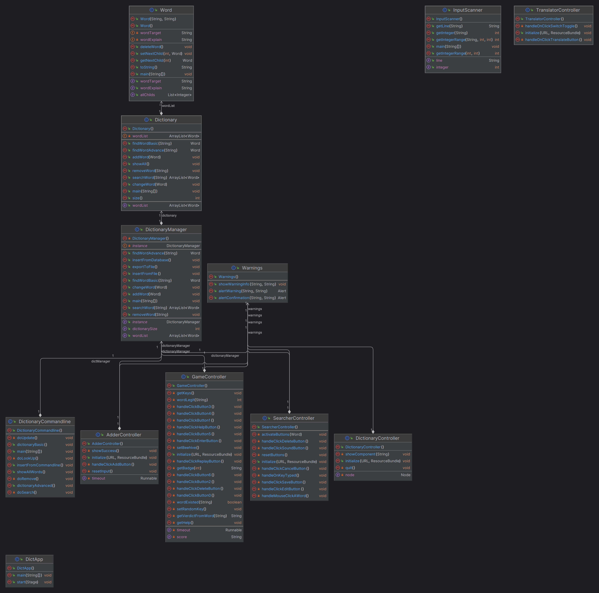

# English Learning App

Final Project for OOP (I2324 INT2204 2)

## Team Members
- [Nguyễn Tân Nguyên (22021117) - K67-C-CLC](https://github.com/Fake4Sad1st)
- [Nguyễn Hồng Quân (22021122) - K67-C-CLC](https://github.com/quanmcvn)
- [Nguyễn Ngọc Vũ (21020038) - K66-C-CLC](https://github.com/dzgod1905)

# UML Tree

    

# Giới thiệu
- Ứng dụng từ điển giúp cho người dùng có thể tra cứu, học từ vựng tiếng Anh một cách nhanh và hiệu quả nhất.
- Kết hợp với các trò chơi giúp người học giải trí sau những giờ học căng thẳng.
- Được viết bằng ngôn ngữ Java và hỗ trợ bởi thư viện JavaFX để tạo ra giao diện đồ hoạ.

## Table of contents
- [Chức năng](#Chức-năng)
  - [Sử dụng từ điển](#Sử-dụng-từ-điển)
  - [Dịch thuật](#Dịch-thuật)
  - [Trò chơi](#Trò-chơi)
- [Công nghệ sử dụng](#Công-nghệ-sử-dụng)
  - [JavaFX](#JavaFX)
  - [Google Translate API](#Google-Translate-API)
  - [Voice RSS API](#Voice-RSS-API)
  - [Trie](#Trie)

# Chức năng
Các tính năng mà ứng dụng sẽ hỗ trợ.
## Sử dụng từ điển
- Tra cứu từ vựng tiếng Anh: phát âm, nghĩa.
- Thêm/sửa/xóa từ vựng.
- Nghe phát âm của từ vựng.

## Dịch thuật
- Sử dụng công cụ dịch thuật của Google Translate để dịch từ vựng, câu văn.

## Trò chơi 
- Giúp người học giải trí.
- Mang tính học thuật, hỗ trợ việc học từ vựng.

# Công nghệ sử dụng
Các kĩ thuật, công nghệ sử dụng để xây dựng ứng dụng.

## JavaFX
- Sử dụng JavaFX để tạo giao diện đồ hoạ cho ứng dụng.
## Google Translate API
- Sử dụng Google Translate API để dịch.
## Voice RSS API
- Sử dụng Voice RSS API để phát âm.
## Trie
- Sử dụng cấu trúc dữ liệu Trie để lưu trữ từ điển.
